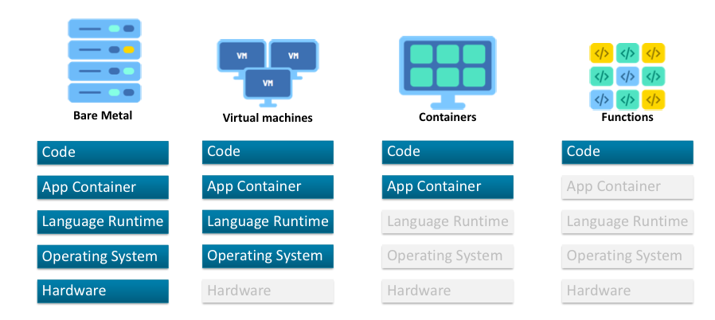

# **Kubernetes Talk**
Let's talk about kubernetes

----
### **Options of How We Can Deploy Our Application**

### **Table Comparison**
|   | Bare Metal | Virtual Machines | Containers | Functions |
| Difficulty of deployment | Hardest  | Hard  | Medium | Easy |
| Time to deploy | Slowest  | Medium  | Fast | Very Fast |
| How much do we need SysOps | 100 percent yes | Yes we need | If dev understand container, answer is no | Not at all |
