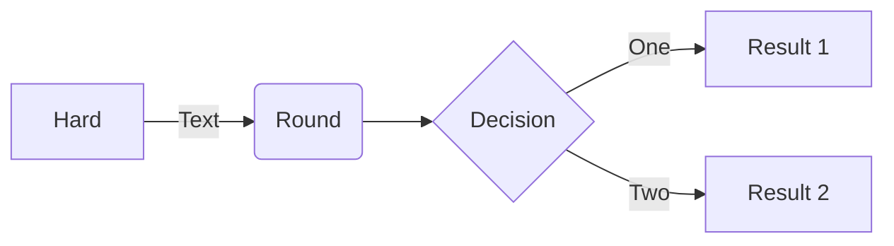

# **Kubernetes Talk**
Let's talk about kubernetes

----
### **Options of How We Can Deploy Our Application**

### **Table Comparison**
|   | Bare Metal | Virtual Machines | Containers | Functions |
| - | - | - | - | - |
| Learning curve | Hardest  | Hard  | Medium | Easy |
| Deployment difficulty | Hardest  | Hard  | Medium | Easy |
| Time to deploy | Slowest  | Medium  | Fast | Very Fast |
| How much do we need SysOps | 100 percent yes | Yes we need | If Dev understand container, answer is no | Not at all |
### **Where to Start**

### **What is Container**
For detail you can read from [here](https://www.docker.com/resources/what-container), but IMHO, container is how you can package your application
with it's dependency so you can run it anywhere.
### **How to Get Your Hands Dirty with Container**
1. Get your hands dirty with linux
> Every command used in Dockerfile is mostly unix, linux based command
2. [Install Docker](https://docs.docker.com/get-docker/)
3. [Create Dockerfile](https://docs.docker.com/language/python/build-images/)
### **Source**
[Functions as a Service: Evolution, Use Cases, and Getting Started](https://blogs.oracle.com/developers/post/functions-as-a-service-evolution-use-cases-and-getting-started)
