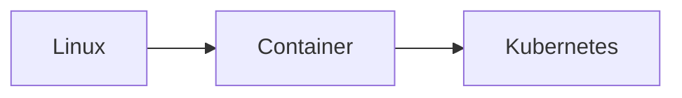

# **Kubernetes Talk**
Let's talk about kubernetes
### **Options of How We Can Deploy Our Application**

### **Table Comparison**
|   | Bare Metal | Virtual Machines | Containers | Functions |
| - | - | - | - | - |
| Learning curve | Hardest  | Hard  | Medium | Easy |
| Deployment difficulty | Hardest  | Hard  | Medium | Easy |
| Time to deploy | Slowest  | Medium  | Fast | Very Fast |
| How much do we need SysOps | 100 percent yes | Yes we need | If Dev understand container, answer is no | Not at all |
### **Where to Start**

### **Learning Linux**
Everyone has different approach for learning, Me myself learning linux with installing linux on my computer, and make it my daily driver, it will
easier for me to push myself to live in linux terminal. But you also can install it in [WSL](https://docs.microsoft.com/en-us/windows/wsl/install), 
[VM](https://www.virtualbox.org/), or provision it in Cloud.

Why we need to "taste" linux first before we can continue to container? Most of command used in container is unix, linux based command, so it make sense
if try linux before we go to container
### **What is Container**
For detail you can read from [here](https://www.docker.com/resources/what-container), but IMHO, container is how you can package your application
with it's dependency so you can run it anywhere.
### **How to Get Your Hands Dirty with Container**
1. [Install Docker](https://docs.docker.com/get-docker/)
2. [Create Dockerfile](https://docs.docker.com/language/python/build-images/)
### **What is Kubernetes**
For TLDR, [check this out](https://kubernetes.io/docs/concepts/overview/what-is-kubernetes/). I couldn't describe how much I love K8S (Kubernetes),
Some feature that i really love is self healing (Don't need Dev to fix app, cuz K8S will replace unhealthy container automatically), and autoscaling 
(Don't need Ops to adding new VM when we need it, cuz K8S have capability for automatically adding based on load)
### **Source**
[Functions as a Service: Evolution, Use Cases, and Getting Started](https://blogs.oracle.com/developers/post/functions-as-a-service-evolution-use-cases-and-getting-started)
